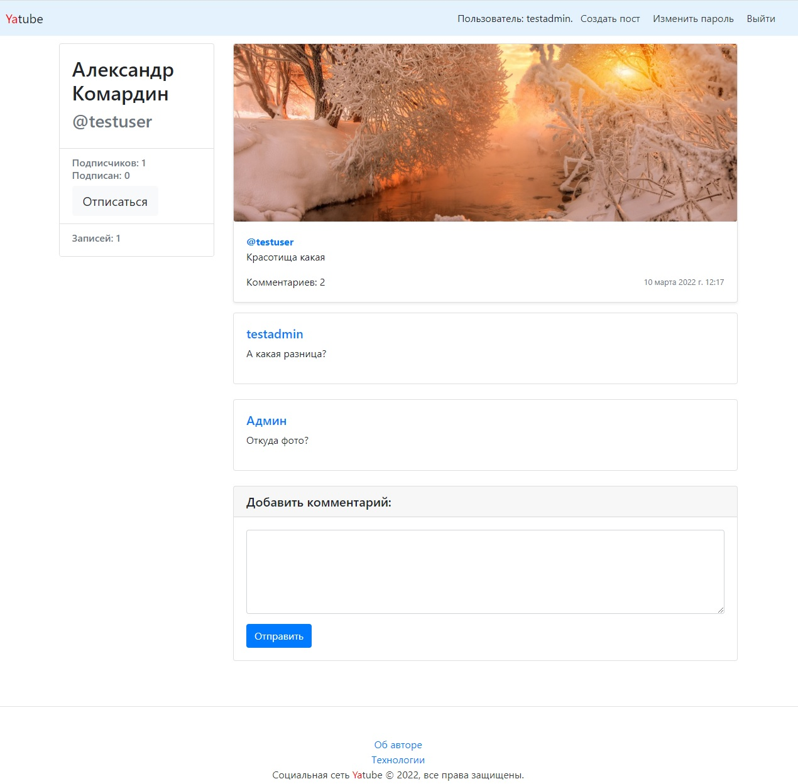

[](https://www.python.org/)
[](https://www.djangoproject.com/)

# Сервис Yatube

```sh
git clone https://github.com/s2dent18/hw05_final.git
```



## Описание сервиса:

Foodgram - социальная сеть для публикации личных дневников.  

## Функционал:

* регистрация, восстановление пароля  
* создание и редактирование своих записей  
* добавление и редактирование изображений  
* просмотр страниц других пользователей  
* комментарии постов  
* система подписок на пользователей  
* система групп  
* фильтрация постов в ленте 
* модерация и создание групп реализованы через панель администратора  

## Локальный запуск проекта:

* Создайте файл с переменными виртуального окружения:  
```sh
python -m venv venv
```    
* Выполните установку зависимостей из файла requirements.txt:   
```sh
pip install -r requirements.txt
```    
* Выполните миграции командой:  
```sh
python manage.py migrate
```  
* Запустите сервер:  
```sh
python manage.py runserver
```  